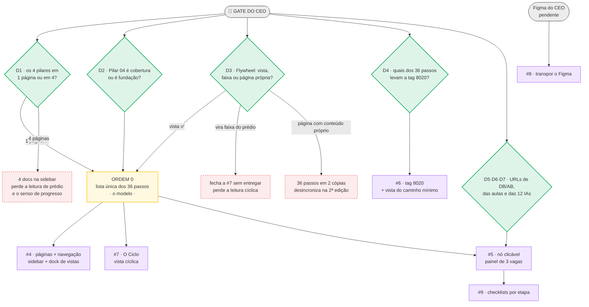

# Cockpit Builder — Blueprint da Arquitetura de Páginas

> **Task:** [`86ajqefwd`](https://app.clickup.com/t/86ajqefwd) · Planejar a arquitetura de páginas do Cockpit
> **Gate:** 🚦 aprovação do CEO antes de codar — destrava 6 subtarefas
> **Base:** `DEMANDA-COCKPIT-ELVIS.md` §6 (fonte da verdade) + código atual do `index.html`
> **Autor:** Elvis Oliveira (Dev Junior) · 2026-07-29

Este documento responde **uma** pergunta: qual estrutura de páginas transforma os
45+ entregáveis do ecossistema num mapa que dá pra executar.

Não propõe layout visual (isso vem do Figma, subtarefa #8). Propõe **estrutura**.

---

## 0. Resumo em 6 linhas

1. **Uma página "A Obra"** com os 4 pilares empilhados como andares de um prédio — não 4 páginas separadas.
2. **"Uma por pilar" vira vista, não página.** O dock (teclas 1-4) enquadra cada pilar. Máquina já existe.
3. **O 8020 é do entregável, não do andar.** Os 36 andares são obrigatórios; o que se escolhe é por qual dos 3 caminhos entrar (§3, revisto em 2026-07-31).
4. **O Flywheel não é redundante nem é conteúdo novo** — é a *mesma* lista de passos renderizada como ciclo em vez de prédio.
5. **O nó clicável abre 3 vagas:** aula · IA · ferramenta (EB / DB / AB). Vaga vazia aparece tracejada e vira backlog visível.
6. **Uma lista de 36 passos sustenta tudo.** Cada página é uma vista filtrada. Zero conteúdo duplicado.

**As 7 decisões que precisam do seu OK estão na §8.** O resto é fundamentação.

---

## 1. O problema, na frase do CEO

> "45+ ferramentas e entregáveis. Quando tudo é importante, nada é importante." (§6.1)

O aluno hoje assiste conteúdo solto na área de membros, sem aplicação no momento
em que precisa. O Cockpit inverte: **o aluno identifica o gargalo → vai na etapa →
o mapa abre as ferramentas + aulas + IAs daquela etapa.**

Norte declarado: organizar de um jeito que fique **impossível de não conseguir
executar** (§1). Não é mapa pra olhar — é mapa pra fazer.

Consequência de arquitetura: **a estrutura tem que carregar ordem e prioridade.**
Uma lista alfabética de 45 ferramentas resolve zero. O que resolve é um caminho
com "faça isso primeiro" embutido na forma.

---

## 2. A metáfora: o prédio

Metáfora oficial = **OBRA** (§6.9 — nunca avião). O Cockpit é a cabine do guindaste;
cada objetivo é uma **obra**; "Obra 10k" é a primeira (§1).

Levando a sério: **os 4 pilares são os andares de um prédio que o aluno sobe.**

```
                          ┌─────────────────────────────┐
   COBERTURA              │  PILAR 04 · AMBIENTE        │  ← "segura os outros três"
   você / mentalidade     │  8 passos                   │
                          ├─────────────────────────────┤
   3º ANDAR               │  PILAR 03 · GESTÃO          │
   o negócio por dentro   │  8 passos                   │
                          ├─────────────────────────────┤
   2º ANDAR               │  PILAR 02 · VALOR PERCEBIDO │
   como o mercado te vê   │  11 passos                  │
                          ├─────────────────────────────┤
   TÉRREO / FUNDAÇÃO      │  PILAR 01 · ENTREGA         │
   o que sai da tua mão   │  9 passos                   │
                          └─────────────────────────────┘
                             ▲ 36 passos no total
```

A ordem vem do §6.3: *"execução → entrega → negócio → topo = VOCÊ/mentalidade
(inverte a pirâmide)"*. Você começa fazendo, e **sobe até chegar em você.**

### Por que empilhado e não lado a lado

Hoje os 4 pilares são 4 cards **na horizontal** (`PX-240 + i*640`). Quatro cards
lado a lado comunicam "quatro assuntos". Quatro andares comunicam **"você está no
2º e falta subir"** — que é a leitura que o §6.5 pede ("marcando e vendo sua evolução").

Prédio também dá o que nenhuma outra forma dá de graça: **um prédio incompleto
ainda é um prédio.** É exatamente o comportamento do 8020 (§3).

### A contradição que precisa da sua decisão

O Pilar 04 tem duas descrições que não fecham:

- §6.3 diz que ele é o **topo** ("inverte a pirâmide")
- A tese dele no código diz: *"este pilar **segura** os outros três"* — que é linguagem de fundação

Nas duas leituras a metáfora funciona, mas o prédio fica diferente:

| leitura | Pilar 04 é | significado |
|---|---|---|
| **A** — topo | cobertura / laje que amarra | você **conquista** o direito de trabalhar em si mesmo |
| **B** — base | fundação | sem mentalidade **nada** sobe; é pré-requisito |

Recomendo **A**, porque é o que o §6.3 diz explicitamente e é a leitura mais
incomum (logo, mais autoral). Mas é sua metáfora — decide você. → **Decisão 2, §8**

---

## 3. O 8020 é do ENTREGÁVEL, não do andar

> **Mudou em 2026-07-31 (migration 009).** O que está escrito abaixo substitui a
> versão anterior desta seção, que marcava 18 dos 36 andares como "estrutura" e
> os outros 18 como "acabamento". O texto velho está no histórico do git — não
> foi corrigido em cima, foi trocado, porque a premissa é que caiu.

**A premissa que caiu:** hierarquia entre andares. Dizer que o passo 3 é viga e o
passo 4 é acabamento ensina ao aluno que metade da obra dá pra deixar pra depois
— e os 36 passos são obrigatórios. O prédio não pula degrau.

**O que sobrou no lugar.** A escolha existe, mas um nível abaixo. Dentro de um
andar há até três caminhos — a **aula** que ensina, a **ferramenta** onde se
executa, a **IA** que acelera — e um ou dois deles é que trazem o resultado.
Escolher qual é o 80/20 daquele andar.

| | é | quem decide |
|---|---|---|
| **80/20** | o caminho que traz o resultado neste andar | quem edita a página, na própria tela |
| os demais | existem, ajudam, não são por onde começar | — |

**Teto de dois por andar.** Marcar os três é o mesmo que não marcar nenhum: um
selo que cobre tudo não escolhe nada. O teto vive em `alternarOitentaVinte`
([src/lib/queries.ts](../src/lib/queries.ts)) e na UI, que desabilita o terceiro
botão antes do clique — não como constraint, pelo motivo explicado na migration.

**O tamanho real da escolha**, contado na lista dos 36:

| entregáveis no andar | andares | o 80/20 é |
|---|---|---|
| 3 | 3 | escolha de verdade |
| 2 | 8 | escolha de verdade |
| 1 | 22 | o único caminho — nada a marcar |
| 0 | 3 | é na unha (`unha:1`) |

Ou seja: **11 andares** têm o que decidir. Nos outros 25, marcar seria carimbar
o que já é único, e selo em tudo não sinaliza nada.

**Onde o dado mora.** Não em `passos.ts`: é escolha editável, então é banco
(`cockpit.entregavel_8020`, migration 009). A tabela é uma camada por cima da
lista dos 36 — linha só existe pra quem foi marcado.

**O que sobrou do campo `e8020`:** relevo no desenho da torre e nada mais. A laje
do andar marcado continua mais grossa; perdeu o glow e o selo escrito, porque
espessura é textura de prédio e nome escrito é hierarquia. `passos8020()` foi
removido junto — filtrar "os que importam" era a própria divergência.

`unha:1` continua como estava: badge "NA UNHA" nos passos que **não têm
ferramenta nem IA** ("Postura", "Delegar", "Eficiência"). Serve pra sinalizar
honestamente onde o sistema não ajuda.

```
   ┌────────────────────────────────────────────────┐
   │ 03 · DESIGN                                    │
   │ ──────────────────────────────────────────     │
   │ ▶ AULA · ensina a fazer                        │
   │   Design Easy                                  │
   │ ⚙ FERRAMENTA · EB · onde você executa  [80/20] │ ← borda acesa
   │   Extensão EB · 1.000+ componentes             │
   │ ✦ IA DE APOIO · o que acelera                  │
   │   IA 09 Diretor Criativo                       │
   └────────────────────────────────────────────────┘
     ▲ a marca está na VAGA, não no andar
```

---

## 4. Navegação: página ≠ vista

Aqui está a resposta pro item mais ambíguo da task ("uma página por pilar").

O Cockpit tem **dois** níveis de navegação, e eles já existem no código:

| nível | controle | o que troca | onde está |
|---|---|---|---|
| **Página** | barra lateral | o documento inteiro (`data-doc`) | `DOCS`, [index.html:4047](index.html#L4047) |
| **Vista** | dock inferior + teclas | o enquadramento dentro da página | `VIEWSET`, [index.html:3953](index.html#L3953) |

**"Uma por pilar" se resolve com vista, não com página.** A tecla `2` enquadra o
Pilar 01, a `3` o Pilar 02, e assim por diante — você tem o zoom individual de cada
pilar *sem* quebrar o prédio em quatro prédios.

Custo: 4 linhas no `VIEWSET`. A função `framePred` já faz o enquadramento por
predicado — é o que a view "Pilares" (tecla 5) já faz hoje.

### Inventário de páginas proposto

```
┌──────────────────────┐
│ 🏗 COCKPIT BUILDER   │
│                      │
│ OBRA 10K             │
│  🏗 O Método         │  ← existe. A tese: funil, conta do 10k, motor de tijolos
│  🧱 A Obra          ◀│  ← NOVA. O prédio: 4 pilares, 36 passos
│  ↻ O Ciclo           │  ← NOVA. Mesmos passos, vista cíclica (§5)
│                      │
│ SETUP AGÊNCIA 6D     │
│  ◇ Onboarding        │  ← existe. Fluxograma do processo
└──────────────────────┘
```

**4 páginas, não 7.** Grupos na sidebar já são suportados (`DOCS` tem `grupo`).

Note a divisão de trabalho entre as duas primeiras: **"O Método" responde por quê
e quanto** (o funil anti-prospecção, a conta do 10k, as esquetes). **"A Obra"
responde o que construir.** Hoje os pilares moram dentro do Método e disputam
atenção com o funil; separados, cada página tem uma pergunta só.

### Vistas de "A Obra"

```
  ⌂ Tudo    Pilar 01    Pilar 02    Pilar 03    Pilar 04
   [1]        [2]         [3]         [4]         [5]
```

**A vista `8020` saiu daqui** (2026-07-31). Ela enquadraria "só os passos
estruturais", e passo estrutural deixou de existir — os 36 são obrigatórios
(§3). O caminho mínimo que sobra não é um subconjunto de andares: é, **dentro de
cada andar**, o entregável marcado. Isso não é enquadramento de câmera, é o
conteúdo do painel — e já aparece lá, no andar aberto.

Se um dia fizer falta como tela própria, ela nasce no Trilho e filtra
`listarOitentaVinte()`, não `e8020`.

> A barra desta página é a **única** barra dela: o dock de baixo não entra na
> Obra ([AppShell](../src/components/shell/AppShell.tsx)). O dock comanda canvas
> — checkpoint de enquadramento, arrastar item, "2× clique: zoom no item" — e a
> Obra não tem canvas: tem câmera própria, comandada por esta barra.

---

## 5. O Flywheel: mesma lista, outra forma

### Sua observação está certa — e é ela que resolve o problema

> *"acredito que pode ser redundante, porque o que eu vi é que o flywheel tinha os
> mesmos passos, só mais enxuto, no ramo de desenvolver e finalizar com o cliente.
> Não tinha etapas como trabalhar a mente. Ele funciona mais como passo a passo de
> trabalho, e o pilar a estrutura para a profissão."*

Os passos **se repetem** de propósito. O que muda não é o conteúdo — é o **eixo de tempo**:

| | O Prédio (pilares) | O Ciclo (flywheel) |
|---|---|---|
| natureza | **cumulativo** | **cíclico** |
| roda quando | uma vez — cada andar fica pronto pra sempre | **a cada cliente**, pra sempre |
| pergunta | "o que eu tenho que construir?" | "o que eu faço agora com esse cliente?" |
| escopo | a profissão inteira, mentalidade incluída | só o que repete por cliente |
| tem mentalidade? | sim (Pilar 04) | **não** — mentalidade não cicla |

Sua leitura de que "não tinha etapas como trabalhar a mente" **é a prova** de que
não é redundância: o flywheel é **menor por definição**, porque mentalidade se
constrói uma vez e não roda por cliente.

O flywheel do §6.6 é o ciclo virtuoso do funil anti-prospecção:

```
              tapa o furo do balde
                      │
                      ▼
        ┌───────►  cliente entra
        │             │
        │             ▼
   menos esforço   entrega bem
   pra próximo        │
        │             ▼
        └────── ele fica / indica
```

### Três caminhos — e o que eu recomendo

| | proposta | conteúdo duplicado? | task #7 | perda |
|---|---|---|---|---|
| **A** ✅ | **Flywheel = 2ª vista sobre os mesmos 36 passos** | nenhum | fica, e fica barata | nenhuma |
| B | Flywheel morre; vira uma faixa dentro do prédio | nenhum | fecha sem entregar | perde a leitura cíclica — que é a tese do funil anti-prospecção |
| C | Flywheel = página com conteúdo próprio (leitura literal da task) | **sim** | fica, e fica caro | a segunda edição desincroniza as duas páginas |

**Recomendo A.** É o que aproveita a sua observação em vez de contorná-la: a
sobreposição deixa de ser um defeito e passa a ser o mecanismo. E responde
literalmente o nome da subtarefa #7 — *"as funcionalidades por setor"* — porque
**as posições do ciclo *são* os setores.**

Na prática: cada passo ganha um campo `cicloPos`. Quem tem `cicloPos` aparece no
Ciclo, na ordem do ciclo. Quem não tem (mentalidade, plano de negócio) só existe
no Prédio. Um dado, duas páginas.

→ **Decisão 3, §8**

---

## 6. O nó clicável

O §6.4 é chamado no próprio documento de "o coração do dev": cada nó, ao clicar,
abre **3 coisas** — ferramentas, aulas, IAs.

### Isso já está meio-construído

Cada passo no código já carrega `chips` tipados
([index.html:3508](index.html#L3508)) — 6 tipos: `ia` `tool` `tpl` `aula` `ref` `proc`.
Exemplo real, o passo "Design" do Pilar 01:

```js
{t:'Design', sub:'Direção com intenção: arquétipo, paleta, tipografia.',
 chips:[ ['tool','Extensão EB · 1.000+ componentes', GO.recursos],
         ['ia',  'IA 09 Diretor Criativo',           GO.app],
         ['aula','Design Easy',                      GO.membros] ]}
```

Os três destinos já estão lá. A subtarefa #5 **não é construir isso** — é promover
o chip inline a um painel com estrutura fixa e legível.

### O painel proposto

Usando o seu exemplo (Diretor Criativo):

```
   ┌──────────────────────────────────────────────────┐
   │  PILAR 01 · ENTREGA            passo 3 de 9      │
   │  Design                                  [8020]  │
   │  ─────────────────────────────────────────────    │
   │  Direção com intenção: arquétipo, paleta,        │
   │  tipografia. Nunca do zero.                      │
   │                                                  │
   │  ▶  AULA        Design Easy                  ↗   │
   │  ⚡  IA          IA 09 · Diretor Criativo     ↗   │
   │  ⚙  FERRAMENTA  Extensão · 1.000+ componentes    │
   │                 ┌────┐                       ↗   │
   │                 │ EB │                           │
   │                 └────┘                           │
   │  ─────────────────────────────────────────────    │
   │  ☐ marcar como feito                             │
   └──────────────────────────────────────────────────┘
```

**Três vagas fixas, sempre nessa ordem.** A ordem importa: *aprende → pensa com a
IA → executa na ferramenta.* É a sequência pedagógica, e ela fica igual nos 36 nós
— o aluno aprende a ler uma vez e lê todas.

O `☐ marcar como feito` é o gancho da subtarefa #9 (checklists, §6.5) — o
checklist não é uma tela separada, **é o próprio nó**.

### O selo da plataforma: EB · DB · AB

Sua ideia de identificar em qual plataforma a ferramenta vive é nova e resolve um
problema real — o aluno precisa saber pra onde está sendo mandado antes de clicar:

| selo | plataforma | cobertura no código hoje |
|---|---|---|
| **EB** | Easy Builder | `app.easybuilder.com.br` — as 12 IAs e os recursos ✅ |
| **DB** | Design Builder | ⚠️ **sem URL no código** |
| **AB** | Arena Builder | ⚠️ **sem URL no código** |

→ **Decisão 5, §8**

### Vaga vazia = backlog visível

Nem todo passo tem os 3. "Postura" e "Delegar" não têm ferramenta nenhuma (já
marcados `unha:1` no código). A vaga que falta **aparece tracejada**, não desaparece:

```
   ▶  AULA        Design Easy                  ↗
   ⚡  IA          IA 09 · Diretor Criativo     ↗
   ┌ ─ ─ ─ ─ ─ ─ ─ ─ ─ ─ ─ ─ ─ ─ ─ ─ ─ ─ ─ ┐
     ⚙  FERRAMENTA   — sem link ainda —
   └ ─ ─ ─ ─ ─ ─ ─ ─ ─ ─ ─ ─ ─ ─ ─ ─ ─ ─ ─ ┘
```

Isso reaproveita convenção que o board já usa (os 6 nós sem destino do Onboarding
aparecem com contorno tracejado) e tem efeito colateral bom: **o mapa mostra o
próprio buraco.** A lacuna de aulas deixa de ser planilha e passa a ser visível.

---

## 7. O que sustenta tudo: uma lista, N vistas

Prédio e Ciclo são **duas leituras dos mesmos 36 passos**. Se cada página tiver
sua própria cópia, a segunda edição desincroniza e o projeto apodrece.

Então: **um registro por passo, e cada página é um filtro.**

```js
{ id:        'p1-design',
  pilar:     1,              // qual andar
  ordem:     3,              // posição no andar
  titulo:    'Design',
  sub:       'Direção com intenção: arquétipo, paleta, tipografia.',
  e8020:     true,           // só relevo no desenho da torre (§3)
  cicloPos:  2,              // posição no flywheel; null = não cicla (§5)
  aula:      {label:'Design Easy',            url:'…'},
  ia:        {label:'IA 09 · Diretor Criativo', url:'…'},
  ferram:    {label:'Extensão · 1.000+ comp', plat:'EB', url:'…'},
  unha:      false }         // true = não tem ferramenta, é na mão
```

36 registros. E cada página cai numa linha:

| página / vista | como se deriva |
|---|---|
| A Obra | agrupa por `pilar`, ordena por `ordem` |
| vista Pilar 0N | filtra `pilar === N` |
| 80/20 do andar | **não sai daqui** — é dado do banco, `listarOitentaVinte()` (§3) |
| O Ciclo | filtra `cicloPos != null`, ordena por `cicloPos` |
| painel do nó | lê `aula` · `ia` · `ferram` do registro |
| checklist | escreve `feito` no registro |

Isso converge com o que o `BLUEPRINT.md` §9 já havia proposto como modelo de
dados, por outro motivo (viabilizar edição). **As duas necessidades pedem a mesma
coisa** — então o trabalho conta duas vezes.

---

## 8. As 7 decisões que precisam do seu OK 🚦

As sete não têm o mesmo peso. **Três travam tudo** — sem elas eu não escrevo linha.
As outras quatro travam **uma coisa cada**, e podem chegar depois sem parar a obra.



**Como ler:** losango verde = decisão sua · amarelo = o modelo de dados (§7) ·
roxo = subtarefa que destrava · tracejado vermelho = o custo de escolher a
alternativa. Mesmo vocabulário visual do board (`BLUEPRINT.md` §3).

Três coisas que o desenho mostra e a tabela não:

1. **Tudo passa pela Ordem 0.** Cinco das seis subtarefas leem da mesma lista de 36
   passos. É o gargalo real do projeto — e hoje não é subtarefa de ninguém.
2. **D4 e D5·D6·D7 são laterais.** Se as URLs demorarem, a #5 entrega o painel com
   as vagas tracejadas e o #6 espera. Nada mais para.
3. **O Figma só trava a #8.** Ele não é insumo deste blueprint — entra depois
   (é o passo 5 do §4 da demanda).

| # | decisão | minha recomendação | por quê |
|---|---|---|---|
| **1** | Os 4 pilares são **1 página com 4 faixas** ou **4 páginas**? | **1 página**, com 4 vistas no dock | O prédio só comunica "falta subir" se estiver inteiro. E "uma por pilar" fica atendido por vista (§4) |
| **2** | Pilar 04 (Ambiente/mentalidade) é **cobertura** ou **fundação**? | **cobertura** | §6.3 diz "topo, inverte a pirâmide". Mas a tese dele diz "segura os outros três" — a metáfora é sua (§2) |
| **3** | O Flywheel é **vista** sobre os mesmos passos, **morre**, ou é **página própria com conteúdo próprio**? | **vista** (opção A) | Zero duplicação, e as posições do ciclo *são* os "setores" que a subtarefa #7 pede (§5) |
| ~~**4**~~ | ~~Quais dos **36 passos** levam a tag 8020?~~ **RESOLVIDA em 2026-07-31 — e a pergunta caiu junto.** Nenhum: o 8020 desceu pro entregável e virou campo editável na tela (§3, migration 009). O que restava de curadoria — qual dos 3 caminhos marcar nos 11 andares com escolha real — passou a ser um clique no painel, não uma lista pra revisar | — | Hierarquia entre andares ensinava que metade da obra dava pra deixar pra depois |
| **5** | **DB** (Design Builder) e **AB** (Arena Builder) têm URL? | — | Só EB está no código. Sem URL, o selo não linka (§6) |
| **6** | Aulas ficam em `easybuilder.club` ou `aulas.easybuilder.com.br`? | — | O código usa `.club`; você falou `aulas.`. Um dos dois está velho |
| **7** | As **12 IAs** têm link individual, ou tudo cai na home do app? | individual, se existir | Hoje as 12 apontam pro mesmo `app.easybuilder.com.br/` — o aluno cai na home e procura |

---

## 9. Ordem de implementação (as 6 subtarefas, reordenadas)

Com o blueprint aprovado, a ordem que minimiza retrabalho:

| ordem | o que | subtarefa | depende de |
|---|---|---|---|
| 0 | Extrair os 36 passos do código pra uma lista única (§7) | *(pré-requisito de todas)* | Decisões 1-3 |
| 1 | Páginas + navegação: sidebar + `VIEWSET` | [#4 `86ajqefwq`](https://app.clickup.com/t/86ajqefwq) | ordem 0 |
| 2 | Nó clicável: painel de 3 vagas | [#5 `86ajqefwz`](https://app.clickup.com/t/86ajqefwz) | ordem 0 + Decisões 5-7 |
| ~~3~~ | ~~Tag 8020~~ **feita em 2026-07-31**, com outro escopo: virou marcação de entregável no painel do andar, com banco e modo de edição (§3) | [#6 `86ajqefxn`](https://app.clickup.com/t/86ajqefxn) | — |
| 4 | Página do Flywheel (como vista) | [#7 `86ajqefyp`](https://app.clickup.com/t/86ajqefyp) | ordem 0 + Decisão 3 |
| 5 | Checklists por etapa | [#9 `86ajqefzc`](https://app.clickup.com/t/86ajqefzc) | ordem 2 |
| 6 | Transpor o Figma | [#8 `86ajqefz3`](https://app.clickup.com/t/86ajqefz3) | Figma chegar |

A ordem 0 não é uma subtarefa hoje. Ela é pequena (mover dado que já existe), mas
**todas as outras cinco leem dela** — se cada uma reescrever os passos por conta,
o projeto ganha 5 cópias divergentes dos mesmos 36 itens.

---

## 10. Pendências que não são minhas

Coisas que travam subtarefas e não dependem de mim:

1. **🔴 O mapa de links das aulas.** A subtarefa [`86ajrj8f2`](https://app.clickup.com/t/86ajrj8f2)
   ("verificar transcrições + criar mapa com todos os links das aulas") está
   **pendente e sem responsável**. Sem ela, um terço de cada nó (a vaga AULA) não
   tem destino — a #5 entrega dois terços.
2. **URLs de DB e AB** (Decisão 5).
3. ~~**O Figma**~~ — **resolvido em 31/07/2026.** O board
   [`Fluxograma Easy Builder | Oficial`](https://www.figma.com/board/hMZj1iR2BaRAcbvB4lB0T4/Fluxograma-Easy-Builder--Oficial-)
   é o mesmo arquivo que gerou o Onboarding — o bloco dele bate nó a nó com o
   que já estava no board. A #8 deixou de estar travada: ver §12.
4. **Subir a `DEMANDA-COCKPIT-ELVIS.md` pro repo** (§9 da própria demanda, item
   aberto). Hoje ela só existe local, e é a referência que eu leio.

---

## 11. Correções de fonte encontradas

Divergências entre a demanda e o código. O código está mais novo:

| onde | demanda diz | código diz |
|---|---|---|
| §6.7, Venda | "**Epson** Vendedor" | **Webson** Vendedor (IA 04) — erro de transcrição da live |
| §9, pendências | acesso do Elvis ao repo pendente | já liberado ([`86ajqefw4`](https://app.clickup.com/t/86ajqefw4) resolvido) |

E uma nota de escopo: o §6.7 lista **7 grupos** de conteúdo (Posicionamento,
Execução, Negócio, Venda, Gestão, Mentalidade, Transversais) contra **4 pilares**.
"Venda" e "Transversais" não têm pilar. Na proposta deste blueprint eles caem no
**Ciclo** — Venda é literalmente o funil anti-prospecção (= o flywheel), e
Transversais é o arsenal que o §6.6 diz estar na roda. Se você discordar, isso
volta pra Decisão 3.

---

## 12. A esteira do Setup 6D (subtarefa #8, transpor o Figma)

O board oficial do CEO tem **52.623 × 26.851 px e 301 objetos de topo**, em sete
blocos. O Onboarding que já estava no Cockpit é o bloco 3 — e é o bloco inteiro,
não um pedaço dele. O que faltava eram os outros seis:

| # | bloco | objetos de topo | estado |
|---|---|---|---|
| 1 | Estrutura de posicionamento e funil | 4 | fora da esteira |
| 2 | Captação de Clientes (Funil Anti Prospecção) | 32 | fora da esteira |
| 3 | Onboarding do Cliente | 67 | veio do legado |
| 4 | Desenvolvimento da Página | 107 | **transposto** |
| 5 | Ajustes finais | 51 | **transposto** |
| 6 | Otimização da Página | 16 | **transposto** |
| 7 | Pós venda e retro-alimentação | 24 | **transposto** |

**Os blocos 3 a 7 são um fluxo só.** O Onboarding termina no terminal
"Desenvolvimento", que é por onde o bloco 4 começa — e assim até o Pós-venda.
Por isso a esteira mora numa página só (`onboarding`) e não em cinco: quebrar
cortaria o fio em cada transição. Os blocos 1 e 2 ficaram de fora porque são
estratégia, não esteira — e o bloco 1 é uma imagem achatada dentro do próprio
Figma (`Group 1171276396 1`, 5017×5047, sem vetor por dentro), então ele não tem
nó nenhum pra virar.

### Como a transposição foi feita

`scripts/figjam-para-esteira.mjs` (gera `dados/esteira.json`) e
`scripts/importar-esteira.mjs` (grava no banco). `npm run db:esteira` roda os dois.

Três coisas foram **medidas, não estimadas** — e cada uma tem como conferir:

1. **Escala.** `app = figma × 0,5 + (20093, 45)`. Saiu de comparar cinco nós do
   Onboarding que existem nos dois lados; a razão de largura bate em
   0,4992..0,5006 nos cinco.
2. **Geometria.** As coordenadas do dump são absolutas em todo nível. Com o
   artefato `1:749` fora, o bbox dos objetos de topo fecha em 52.623 × 26.851 —
   exatamente o que o Figma informou pro render.
3. **Cor.** O dump do FigJam não traz preenchimento, e é a cor que separa `act`
   roxo de `doc` rosa de `copy` amarelo. Ela foi amostrada em pixel
   (`dados/figjam-cores.tsv`), e o mapa forma+cor → tipo foi conferido contra os
   19 nós do Onboarding cujo tipo já era conhecido: **19 de 19**.

Uma exceção anotada no código: **losango é sempre `dec`**, sem olhar a cor.
Quando o losango cai dentro da swimlane de aprovação, as amostras das pontas
pegam o amarelo do fundo em vez do verde da forma.

### O que entrou

137 nós e 53 arestas: 30 de fluxograma, 7 faixas de bloco, 17 rótulos e
**80 prints**. Os prints foram recortados de um render do board em 30.000 px
(≈57% do tamanho original) e vivem em `public/assets/esteira/`, um arquivo por
nó — mesmo padrão que `scripts/extrair-imagens.mjs` usa no Método.

### O que ficou de fora, de propósito

- **61 molduras** — retângulos escuros sem texto que só emolduram print no Figma.
- **7 conectores** internos a grupo, que viravam auto-laço depois de redirecionados.
- **Nome de layer** ("image 45", "Group 1171276438") não virou legenda: é nome de
  arquivo, não conteúdo, e apareceria como figcaption em 80 prints.
